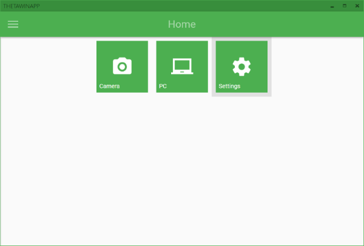
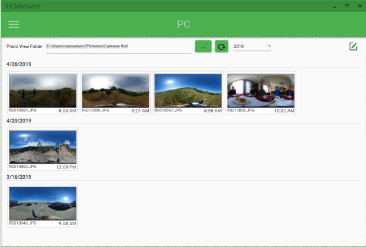

# ThetaNetCore
.NET Library for controlling Ricoh Theta Cameras

This library is build base on the API specification provided by Ricoh.
If you are not clear about the details, you may check their web page.
[API v2 Reference](https://developers.theta360.com/en/docs/v2.1/api_reference/)

The library is written with .Net Standard 2.0, so it should work for other OS using Xamarin.

## Architecture
*ThetaWifiApi* is almost direct translations of API specification. If you know enough about the THETA API, instantiate this class and use it. This class is basically do the network communication and JSON data handling.

For most of you will use the *ThetaWifiConnect*. It is a wrapper of the THETA API to make complicated task simple, which involves several set of calls. If you need tasks that are not wrapped by the class, you retrieve *ThetaWifiApi* from the instance. 

Classes in Wifi\Request and Wifi\Respond directory are self explanetory. They are direct conversion of JSON data to C# object.

## How to use
1. Declare an instance of ThetaWifiConnect.

    ```
    ThetaWifiConnect _theta = new ThetaWifiConnect();
    ```

1. You may register some listeners 

	```
    _theta.ImageReady += ThetaApi_ImageReady;
	_theta.OnTakePictureCompleted += ThetaApi_OnTakePictureCompleted;
	_theta.OnTakePictureFailed += ThetaApi_OnTakePictureFailed;
    ```

1. This one checks if the connecion is ready
    ```
    await _theta.CheckConnection();
    ```
1. Get the information of the camera
    ```
    var info = await _theta.ThetaApi.InfoAsync();
    ```
    Notice that getting information is a simple single call, so we retrieve the ThetaApi and operates on it. 
1. Get the status of the camera
    ```
	var status = await _theta.ThetaApi.StateAsync();
    ```
    'status' holds everything

1. When you start preview
    ```
	_theta.StartLivePreview();
	```
    ImageReady events are called many times. It's a Jpeg format.
    Beware that it is not an UI thread.
    ```
    private void ThetaApi_ImageReady(byte[] imgByteArray)
    {
        // JPEG format data
        this.Dispatcher.BeginInvoke(System.Windows.Threading.DispatcherPriority.Normal, new Action(delegate
        {
            try
            {
                var source = LoadImage(imgByteArray);
                imgPreview.Source = source;
            }
            catch (Exception ex)
            {
                HandleException(ex);
            }

        }));
    }
    ```
    Stop previewing. 
	```
	_theta.StopLivePreview();
    ```

1. Taking picture is also simple.
    ```
	await _theta.TakePictureAsync();
    ```
    When succeeded, completed event will be called.
    ```
    private void ThetaApi_OnTakePictureCompleted(string fileName)
    {
        ...
    }
    ```
    And if it failed, failed event will be called.
    ```
    private void ThetaApi_OnTakePictureFailed(Exception ex)
	{
        ...
    }
    ```
1. Use SetOptions to configuring camera settings

    ```
    var options = new OptionValues();
	options.PreviewFormat = new PreviewFormat(){ Width=1920, Height=960, Framerate=8 };
	await _theta.ThetaApi.SetOptionsAsync(options);

    ```
    Set values that you are updating only.  

## ThetaWinApp

Windows implementaion of Theta application. It is written with WPF. You will see more examples of how you should implement. 

Classes under the "Controls/Camera" folder are the ones interacting with THETA camera.

Start page is like this


You need to check connection. 
Once connection is confirmed, you can take pictures and download them.


You can browse pictures in your camera and PC.


And the 360 image viewer.

